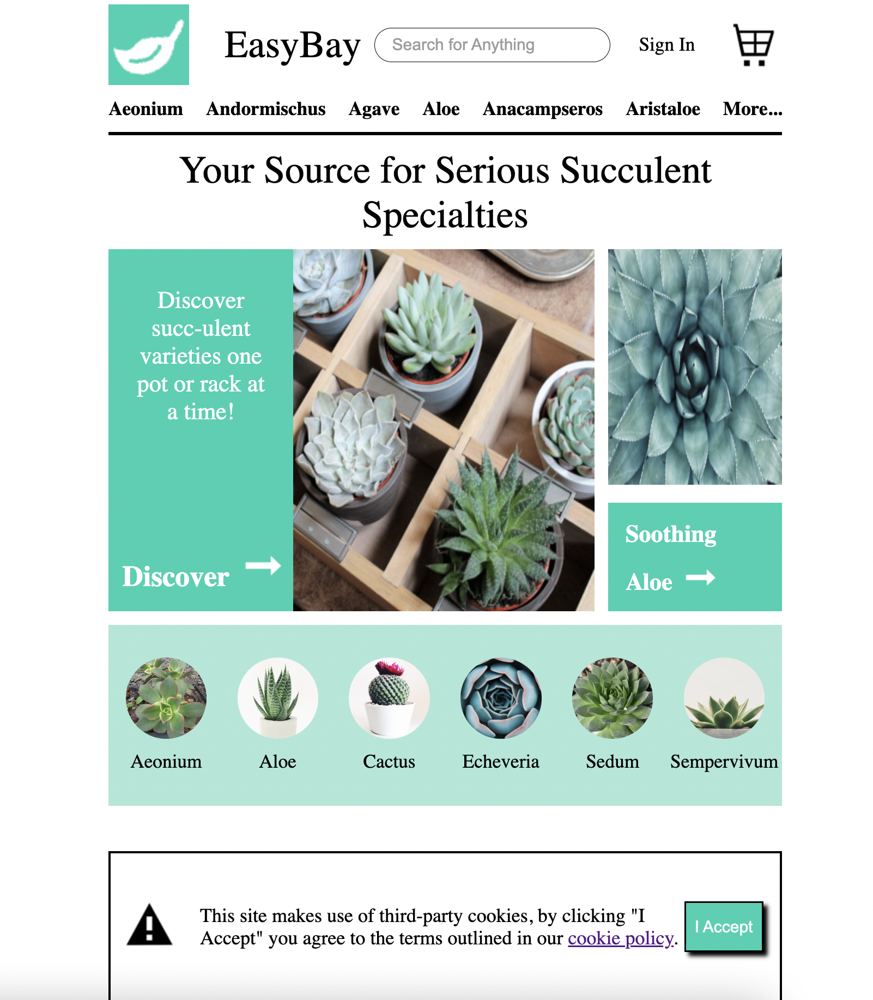
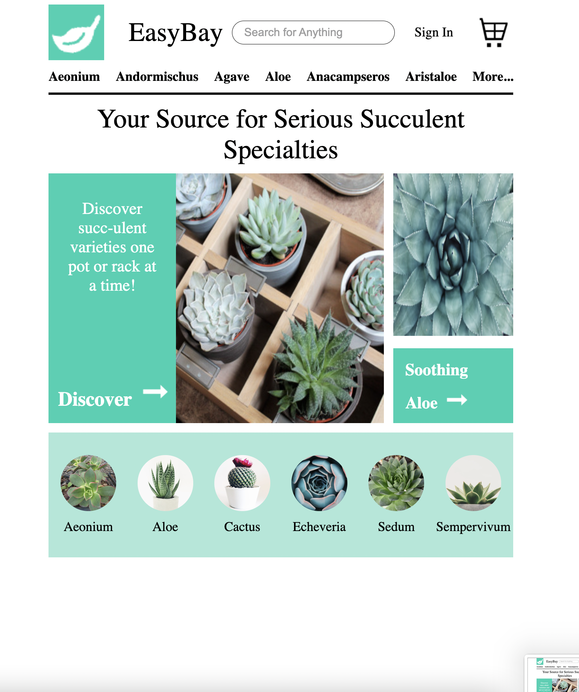

<h1 align='center'>EasyBay</h1>

A HTML-CSS-JS website single page    
(P.S. All links route to my coding bootcamps main page)

### Features

- Responsive web page utilizing CSS styling
- Single Page HTML application
- JavaScript DOM manipulation

### Summary

This application is a designed main page with minimal functionality. It was built to replicate the main page of a Ebay-esque website. The project was a challene to my begginner Web Development skills

### Photos

- Project Main Page with Cookies Popup

- Project Main Page without Popup

### How to Run Locally

- Instructions Coming Soon....
